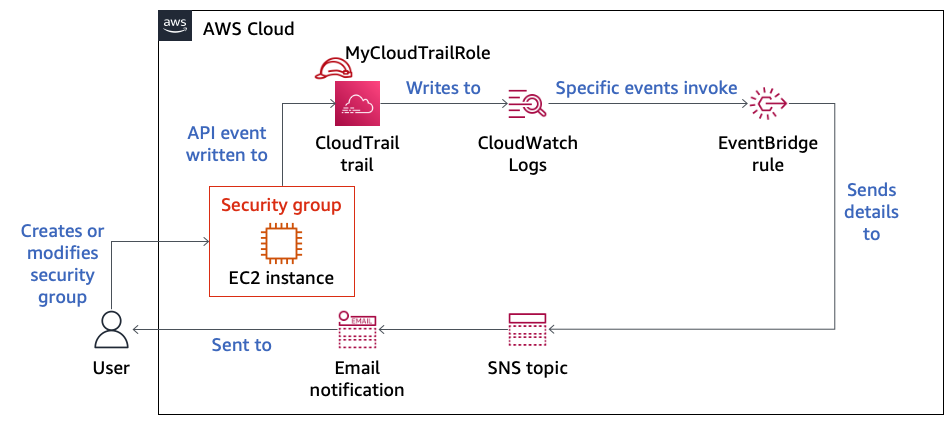
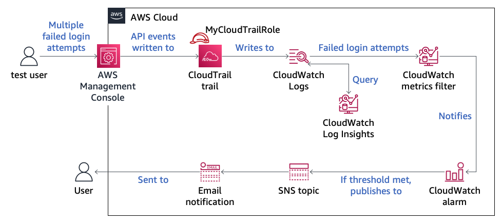

# Lab 6.1 — Monitoring & Alerting with **AWS CloudTrail**, **CloudWatch**, **SNS** & **EventBridge**  

---

## ✨ Why this repo exists
Modern cloud workloads **must** be observable and auditable.  
In this guided lab I built a full-stack monitoring & alerting pipeline that

* **Logs** every API call with CloudTrail  
* **Streams** those logs to CloudWatch Logs  
* **Detects & Alerts** on security-sensitive activity (e.g. security-group changes) via EventBridge + SNS  
* **Raises Alarms** on anomalous behaviour (multiple failed console log-ins) with CloudWatch Metric Filters & Alarms  
* **Queries** historical logs with CloudWatch Logs Insights  

This repository contains

* All **screenshots** captured while completing the lab (`/screenshots`)  
* High-level **architecture diagrams** (`/architecture`)  
* A step-by-step **walk-through** of what was built, why it matters, and the results  

Feel free to clone / fork if you want to replicate the setup or use the README as inspiration for your own projects.

---

## 🗺️ High-level architecture

| After Task 3 | After Task 5 |
|:------------:|:-----------:|
|  |  |

---

## 📂 Repo structure
```text
.
├── architecture
│   ├── end-task-3.png
│   └── end-task-5.png
├── screenshots
│   ├── Task1(1).png … Task1(4).png   # CloudTrail & trail creation
│   ├── Task2(1).png … Task2(3).png   # SNS topic + subscription
│   ├── Task3(1).png … Task3(4).png   # EventBridge rule & email alert
│   ├── Task4(1).png … Task4(4).png   # Metric filter, alarm, failed log-ins
│   └── Task5(1).png … Task5(2).png   # Logs Insights query
└── README.md
```
---

## 1️⃣ Task 1 — CloudTrail Trail + CloudWatch Logs  

| Step | What I did | Proof |
|------|------------|-------|
| 1 | Inspected **Event History** &nbsp;<br>filtered on `cloudformation.amazonaws.com` and opened the most-recent **CreateStack** event. | .png) |
| 2 | Verified the **LabCloudTrail** trail already existed & had CloudWatch Logs enabled. | .png) |

---

## 2️⃣ Task 2 — SNS Topic & Email Subscription  

| Step | What I did | Proof |
|------|------------|-------|
| 1 | Created a **Standard** SNS topic called `MySNSTopic`, opened its detail page, and confirmed the access policy allows *Everyone* to publish/subscribe (lab requirement). | .png) |
| 2 | Added an **email** subscription.<br>Left screenshot shows `PendingConfirmation`, right shows `Confirmed` after clicking the link in my inbox. | .png)<br>.png) |

---

## 3️⃣ Task 3 — EventBridge Rule for Security-Group Changes  

| Step | What I did | Proof |
|------|------------|-------|
| 1 | Built a rule called `MonitorSecurityGroups` with this JSON event pattern:<br>`AuthorizeSecurityGroupIngress` or `ModifyNetworkInterfaceAttribute` from `ec2.amazonaws.com`. | .png) |
| 2 | Configured an **Input Transformer** to craft a meaningful alert message that includes the SG-ID, API call, timestamp and full request parameters. | .png) |
| 3 | Simulated a change by adding an **SSH (22)** inbound rule to `LabSecurityGroup`. CloudTrail captured the `AuthorizeSecurityGroupIngress` event. | .png) |
| 4 | Received the SNS email alert triggered by the rule (proof of end-to-end pipeline). | .png) |

---

## 4️⃣ Task 4 — CloudWatch Alarm for Failed Console Logins  

| Step | What I did | Proof |
|------|------------|-------|
| 1 | In **CloudTrailLogGroup** I created a **Metric Filter** that increments `ConsoleLoginFailureCount` whenever the log record shows `ConsoleLogin` + `"Failed authentication"`. | .png) |
| 2 | Added a CloudWatch **Alarm** `FailedLogins` that triggers when the metric sum ≥ 3 within 5 minutes and sends to `MySNSTopic`. | .png) |
| 3 | Used the `test` IAM user to enter a wrong password 3×. Alarm went **In alarm** and the history shows the state change. | .png) |
| 4 | Verified the SNS email about multiple failed logins. | .png) |

---

## 5️⃣ Task 5 — Deep-dive with CloudWatch Logs Insights  

| Step | What I did | Proof |
|------|------------|-------|
| 1 | Queried `CloudTrailLogGroup` for failed console logins, grouped by source IP, region and IAM ARN. | .png) |
| 2 | The table shows counts per attacker IP and ties directly to the alarm above — great for investigation. | .png) |

---

## ✅ Key take-aways

* **Centralised logging** with CloudTrail → CloudWatch Logs is the foundation for detection.
* **EventBridge** rules are perfect for low-latency, pattern-based alerts on specific API calls.
* **Metric Filters + Alarms** convert raw logs into actionable, threshold-based notifications.
* **SNS** decouples alert generation from delivery channels (email, SMS, Lambda, …).
* **Logs Insights** is invaluable for ad-hoc forensics without shipping data elsewhere.

> **Result:** My AWS account now self-detects & alerts on suspicious network changes and brute-force log-in attempts — a solid baseline for production-grade security monitoring.

### Key takeaway  
Logs Insights is powerful for ad-hoc security hunts without external SIEM costs.

---

## 🔑 What I built & why it matters  

| Layer | Service(s) | Purpose |
|-------|------------|---------|
| **Audit log** | CloudTrail ➜ S3 & CloudWatch Logs | Complete record of every API call (who, what, when, where). |
| **Event routing** | Amazon EventBridge | Detects sensitive API calls & routes to targets. |
| **Notification** | Amazon SNS | Fan-out alerts (email; could add Slack, Lambda, PagerDuty…). |
| **Metrics & alarms** | CloudWatch Logs, Metric Filters, Alarms | Turns raw logs into actionable signals (e.g., brute-force detection). |
| **Ad-hoc analysis** | CloudWatch Logs Insights | Instant querying & visualization for investigations. |

Together these services deliver **serverless, pay-as-you-go security monitoring** across the AWS stack.

---

## 🚀 Next improvements

* Automatically remediate rogue SG changes via Lambda.  
* Centralize across accounts with AWS Organizations & Security Hub.  
* IaC-ify (CloudFormation/CDK) for production deployments.

---

## 📚 References

* [AWS CloudTrail](https://docs.aws.amazon.com/cloudtrail/)  
* [Amazon EventBridge](https://docs.aws.amazon.com/eventbridge/latest/userguide/)  
* [Amazon SNS](https://docs.aws.amazon.com/sns/)  
* [Amazon CloudWatch](https://docs.aws.amazon.com/cloudwatch/)  

> _Lab content © 2022 Amazon Web Services. Screenshots used under educational fair-use._

